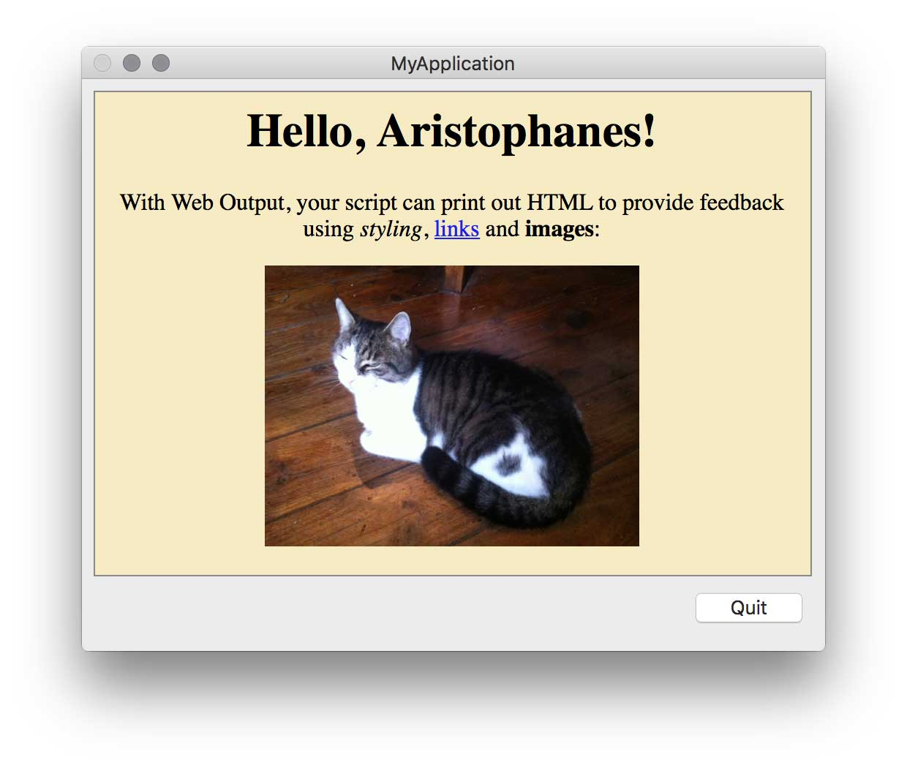
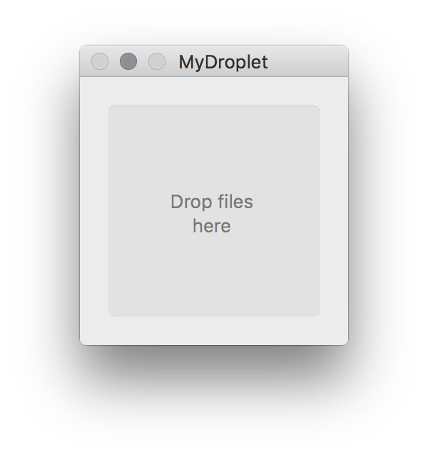

# Platypus Documentation v. 5.2

Last updated on June 3rd 2017, by [Sveinbjorn Thordarson](mailto:sveinbjornt@gmail.com). The latest version of this document can be found [here](http://sveinbjorn.org/platypus_documentation).


* [Introduction](#introduction)
  + [About Platypus](#about-platypus)
  + [Credits](#credits)
  + [How does Platypus work?](#how-does-platypus-work-)
  + [What Platypus is NOT](#what-platypus-is-not)
  + [System Requirements](#system-requirements)
* [The Basics](#the-basics)
  + [Basic Interface](#basic-interface)
  + [Interpreter](#interpreter)
  + [Interface](#interface)
    - [None](#none)
    - [Progress Bar](#progress-bar)
    - [Text Window](#text-window)
    - [Web View](#web-view)
    - [Status Menu](#status-menu)
    - [Droplet](#droplet)
  + [Setting the Icon](#setting-the-icon)
  + [Identifier, Author and Version](#identifier-author-and-version)
  + [Special Options](#special-options)
  + [Bundled Files](#bundled-files)
* [Advanced Options](#advanced-options)
  + [Accepting files and dragged items](#accepting-files-and-dragged-items)
  + [Build-Time Options](#build-time-options)
  + [Built-In Editor](#built-in-editor)
  + [Syntax Checking](#syntax-checking)
  + [Show Shell Command](#show-shell-command)
* [Preferences](#preferences)
* [Profiles](#profiles)
  + [Saving and Loading](#saving-and-loading)
  + [Using Profiles with the Command Line Tool](#using-profiles-with-the-command-line-tool)
  + [Platypus Profile Format](#platypus-profile-format)
* [Controlling GUI with script output](#controlling-gui-with-script-output)
  + [Showing an Alert](#showing-an-alert)
  + [Showing a Notification](#showing-a-notification)
  + [Controlling the Progress Bar](#controlling-the-progress-bar)
  + [Terminating Application](#terminating-application)
  + [Loading a Website into a Web View](#loading-a-website-into-a-web-view)
  + [User interaction with CocoaDialog](#user-interaction-with-cocoadialog)
  + [Creating a Status Menu app](#creating-a-status-menu-app)
  + [Prompting for input via osascript/AppleScript](#prompting-for-input-via-osascriptapplescript)
* [Examples](#examples)
  + [Built-In Examples](#built-in-examples)
* [Updates](#updates)
  + [Updating Platypus](#updating-platypus)
* [Frequently Asked Questions](#frequently-asked-questions)
  + [Can I use Platypus to create proprietary software?](#can-i-use-platypus-to-create-proprietary-software-)
  + [My script's output isn't being shown until the script is done running](#my-script-s-output-isnt-being-shown-until-the-script-is-done-running)
  + [Does Platypus support localizations?](#does-platypus-support-localizations-)
  + [How does my script get the user's environment (e.g. PATH)?](#how-does-my-script-get-the-users-environment-eg-path-)
  + [How can I pass specific arguments to my script?](#how-can-i-pass-specific-arguments-to-my-script-)
  + [How do I uninstall Platypus?](#how-do-i-uninstall-platypus-)
  + [How do I get the source code to Platypus and Platypus-generated app binaries?](#how-do-i-get-the-source-code-to-platypus-and-platypus-generated-app-binaries-)
  + [How do I get the path to my application and/or bundled files from within the script?](#how-do-i-get-the-path-to-my-application-andor-bundled-files-from-within-the-script-)
  + [How do Platypus-generated applications work?](#how-do-platypus-generated-applications-work-)
  + [Can I change the dimensions of my app's window?](#can-i-change-the-dimensions-of-my-apps-window-)
  + [Can I prompt for user input (STDIN) in my Platypus-wrapped scripts?](#can-i-prompt-for-user-input-stdin-in-my-platypus-wrapped-scripts-)
  + [Is there a way to sign Platypus-generated apps so they don't require GateKeeper approval?](#is-there-a-way-to-sign-platypus-generated-apps-so-they-dont-require-gatekeeper-approval-)
  + [Can I pass arguments to a Platypus-generated app via the command line?](#can-i-pass-arguments-to-a-platypus-generated-app-via-the-command-line-)
  + [Where is the command line tool installed?](#where-is-the-command-line-tool-installed-)


## Introduction


### About Platypus

Platypus is a Mac OS X developer tool that creates application wrappers around scripts.  It turns interpreted scripts into regular Mac OS X applications that can be launched from the Mac OS X window environment -- e.g. the Finder or the Dock -- without requiring use of the command line interface.

Platypus was first conceived in 2003 and implemented using the Carbon APIs.  It has since gone through over three dozen major updates, and is now entirely written in Objective C for the Cocoa APIs.

Platypus is free, open-source software distributed under the terms and conditions of the BSD license.  This means the source code is freely available and you are free to modify and distribute it as you see fit.  For more information on licensing, see [Can I use Platypus to create proprietary software?](#can-i-use-platypus-to-create-proprietary-software-).

<form action="https://www.paypal.com/cgi-bin/webscr" method="post" style="float: right; margin-left: 40px;">
<input type="hidden" name="cmd" value="_s-xclick">
<input type="hidden" name="hosted_button_id" value="BDT58J7HYKAEE">
<input type="image" src="https://www.paypalobjects.com/WEBSCR-640-20110306-1/en_US/i/btn/btn_donate_LG.gif" border="0" name="submit" alt="PayPal" width="92" height="26">

</form>

While Platypus is free, it is the product of countless hours of work spanning well over a decade.  If Platypus makes your life easier, please **[make a donation](http://sveinbjorn.org/donations)** to support further development.

While I am happy to respond to feature requests, bug reports and questions concerning Platypus which are not addressed in this document, I cannot respond to queries about the particulars of scripting languages.  Productive use of Platypus assumes that you are competent in your scripting language of choice and understand the UNIX shell environment.


### Credits

Platypus was conceived and created by me, [Sveinbjorn Thordarson](mailto:sveinbjornt@gmail.com).

The Platypus icon -- [Hexley](http://www.hexley.com/), the Darwin mascot -- was created by Jon Hooper, who was kind enough to grant me permission to use it as the Platypus application icon.

Thanks go to Troy Stephens, the original author of the [IconFamily](http://iconfamily.sourceforge.net/) class used for icon handling in Platypus, Bryan D K Jones author of [VDKQueue](https://github.com/bdkjones/VDKQueue), Gianni Ceccarelli for contributing code on authenticated script execution, Matt Gallagher for secure temp file code, and Andy Matuschak for the [Sparkle](http://sparkle-project.org) update framework.  The [OmniGroup](https://www.omnigroup.com) Mac OS X Development mailing list and [Stack Overflow](http://stackoverflow.com) have also been invaluable over the years.

Finally, I am much indebted to [Wilfredo Sanchez](http://www.wsanchez.net), author of [DropScript](http://www.wsanchez.net/software), the proof-of-concept project which inspired me to create Platypus in the first place.


### How does Platypus work?

Regular Mac OS X applications are [bundles](https://en.wikipedia.org/wiki/Bundle_%28OS_X%29) -- special folders with a specific directory structure. An executable binary is stored in the bundle along with resources and configuration files. This binary is run when the bundle is opened in the graphical user interface.

Platypus creates applications bundles with a special executable binary that launches a script and captures its output.  The binary can be configured to present the script's text output in the GUI in various ways, for example by showing a progress bar, a text view, a Status Item menu or a WebKit-based web view.


### What Platypus is NOT

Platypus is **not** a set of bindings between the native Mac OS X APIs and scripting languages.  It is not a full GUI development environment for Mac OS X and is not intended for creating substantial applications with complex and dynamic user interaction.  If you want to create advanced Mac OS X applications, you should learn to program using the Cocoa APIs.  Platypus is not and never will be a substitute for learning to use the excellent native application programming interfaces.

That being said, you may be able to add some interactive GUI elements using [CocoaDialog or Pashua](User interaction with CocoaDialog), or even [AppleScript](#prompting-for-input-via-osascript-applescript).


### System Requirements

As of version 5.0, both the Platypus application and the applications it generates require **Mac OS X 10.7** or later and are provided as 64-bit Intel binaries.  If you want to target 10.6 and/or 32-bit systems, [version 4.9](http://sveinbjorn.org/files/software/platypus/platypus4.9.zip) continues to work just fine. If you want to target 10.4 and PowerPC users, you can use version [4.4](http://sveinbjorn.org/files/software/platypus/platypus4.4.zip).


## The Basics


### Basic Interface

The basic Platypus interface is pretty straightforward.  As soon as you launch the Platypus application, you see a window like this:


Press the **Select Script.."** button and select your script. Then configure the following:

**App Name**

The name of your application. Once you press the "Create" button, you will be prompted again for a name for your app. However, that will only be the name of the actual application bundle directory on the file system, so make sure you put in the proper application name here.

**Script Path**

This field contains the path to the script you create the app from. You either define this manually by typing the path into the text field (which supports shell-style autocomplete), or by pressing the **Select** button and selecting it in a navigation dialog (or by dragging your script on to the Platypus window).


    
Once you have selected a valid script, you can press the **Edit** button to open it in your default text editor. Platypus includes a very basic built-in text editor. You can change this in the **Preferences** if you want to use a more capable external text editor.

The **New** button creates a text file for you in Platypus' Application Support folder and opens it in your default editor. The **Reveal** button reveals the script file in the Finder.


### Interpreter


You can use **Script Type** to specify the scripting language of your script. Either select one of the predefined scripting languages from the the pop-up menu or type in the path to an interpreter binary of choice.

Most of the time, you do not need to specify this manually.  Whenever you select a script file, Platypus automatically tries to determine what kind of script it is by looking at the file suffix and shebang (#!) line.  If you have specified this meta-data in the script file itself, Platypus is usually smart enough to figure it out.

Please note that the interpreter you selected must exist on the Mac OS X system where the application runs.  All the preset scripting language interpreters (e.g. shell, Perl, Python, PHP, Tcl, Expect etc.) are a standard part of all Mac OS X installations.

**Args** let you specify arguments to the script and/or its interpreter.


### Interface


**Interface** sets the user interface for the application. Platypus provides six interface types:

#### None

Windowless application that provides no graphical feedback. All script output is redirected to `STDERR`.

#### Progress Bar

A small window with an indeterminate progress bar and a "Cancel" button appears during the execution of the script. Script output is fed line by line into the text field above the progress bar. "Show details" triangle reveals a small text view containing full script output.


#### Text Window

Shows a window with a text view which displays script output. Please note that the text view is *not* a full, interactive terminal session, and cannot prompt for input from the user via STDIN. It does not support any of the standard terminal commands and cannot be used to display ncurses-based interfaces.

The styling and properties of the text view can be set by pressing the **Text Settings** button.  This shows a window where font, color and size can be configured.


#### Web View

Output from the script will be rendered as HTML in a WebView window.  This allows you to use HTML formatting and web technologies to provide feedback on script execution.

The base directory for the browser instance is the application bundle's Resources directory, so you can bundle images and other support files by adding them to the **Bundled Files** list and referencing them relative to that directory.



#### Status Menu

Application creates a Status Item in the menu bar when launched.  Every time the status item is clicked, the script is executed and its text output is shown line for line in a menu. If a menu item is selected, the script is executed again with the title of the selected menu item passed as an argument to the script.

The properties of the Status Item (icon, title, etc.) can be configured by pressing the **Status Item Settings** button.


#### Droplet

Creates a square window instructing the user to drop files on it for processing.  While processing, script output will be displayed line for line within the box along with an indeterminate circular progress indicator.




### Setting the Icon


Platypus lets you set an icon for your application.  You can pick from the icon presets, paste your own image or select an image or icon file.

Please note that having Platypus create the icon from an image file will typically not result in an icon that looks good in smaller sizes.  For best results, use professional Mac OS X icon-editing software and specify a carefully crafted .icns file using the **Select .icns file** option.


### Identifier, Author and Version

The **Identifier** text field sets the unique identifier for the application.  If you have already provided an application name, this will default to something in the form of "org.username.YourAppName".

Every Mac OS X application has a unique string called a bundle identifier, which takes the form of a reverse DNS name (e.g. "com.apple.iTunes" or "org.sveinbjorn.Platypus"). Platypus automatically formats the bundle identifier using the application name and default user name, but you can set it to something else if you want to. The default bundle identifier prefix used to autogenerate the identifier can be configured in the **Preferences**.


You can also set **Author** and **Version** metadata. This information will appear in the "Get Info" window for your application in the Finder, and also in the About window accessible through the application menu.


### Special Options


**Run with root privileges:**  If selected, the application prompts for an Administrator password and executes the script with escalated privileges via Apple's Security Framework.  This is not strictly equivalent to running the script *as the root user*.  For details, see the [documentation for the Mac OS Security Framework](http://developer.apple.com/mac/library/documentation/Security/Reference/authorization_ref/Reference/reference.html#//apple_ref/c/func/AuthorizationExecuteWithPrivileges).

*Platypus scripts must not use the 'sudo' command*. This causes the script to prompt for input via standard input, and since no input is forthcoming, the application will hang indefinitely.

Please note that if this option is selected, the script will not print `STDERR` output due to limitations in the Security APIs.  This can be circumvented by using a shell script to execute another script while piping `STDERR` into `STDOUT` (e.g. `perl myScript.pl 2>&amp;1`).

**Runs in background:** If selected, the application registers itself as a User Interface Element (LSUIElement). This means the application icon will not show up in the Dock while the app is running.

**Remain running after completion**: This option tells the application to remain open after the script has executed.


### Bundled Files

The Bundled Files list shows files that should be copied into the Resources folder of the resulting application bundle. These files can then be used by your script, which is run from the Resources directory.


See also [How do I get the path to my application / bundled files within the script?](#how-do-i-get-the-path-to-my-application-and-or-bundled-files-from-within-the-script-) in the FAQ.


## Advanced Options


### Accepting files and dragged items

Selecting **Accept dropped items** makes the application bundle accept drag and dropped files, or dragged text snippets.  If this option is selected, a small button called **Settings** appears next to the checkbox. Pressing it opens the **Drop Settings** window, where it is possible to specify which file types and draggable data the application accepts.


Selecting **Accept Dropped Files** results in the paths of dropped or opened files being passed on to the script as arguments.  The default behaviour for applications is to accept all file suffixes, but it is also possible to specify a limited set of suffixes or [Uniform Type Identifiers](https://en.wikipedia.org/wiki/Uniform_Type_Identifier) (NB: If you provide UTIs, the suffixes are ignored by Mac OS X launch services).

To accept dragged folders, add the UTI `public.folder`. HINT: You can drag files from the Finder into the suffix or UTI list to add their respective suffix/UTI.

Optionally, select a document icon (.icns file) for the files "owned" by your app.

Selecting **Accept Dropped Text** makes the app accept dragged snippets of text, in which case the dragged text string will be passed to the script via `stdin`.

**Provide macOS Service** makes the app register as a text-processing [Dynamic Service](http://www.computerworld.com/article/2476298/mac-os-x/os-x-a-quick-guide-to-services-on-your-mac.html), accessible from the **Services** submenu of application menus. You also need to enable this if you want your app to accept text snippets or URLs dropped on its icon.

**Register as URI scheme handler** makes the app register as a handler for URI schemes. These can be either standard URI schemes such as http or a custom URI schemes of your choice (e.g. myscheme://). If your app is the default handler for a URI scheme, it will open every time such a URL is opened and run the script with the URL as sole argument.


### Build-Time Options

Platypus allows you to **create development versions** of your script application.  Ordinarily, Platypus will copy your script and any bundled files into the application it creates.  If **Development Version** is selected in the **Create app** dialog, a symlink to the original script and bundled files is created instead.  This allows you to work on your script while testing it as a Platypus app.


**Optimize Application**: Strip and compile the nib file in the application in order to reduce its size. This makes the nib uneditable. Only works if XCode is installed.

**Use XML property lists instead of binary**: Create human-readable and human-editable plain text XML property lists in the application bundle.  XML property lists are slower to parse and use up more space, but can be edited with a plain text editor, whereas binary property lists can only be edited using XCode or third-party Apple Property List editors.


### Built-In Editor

Platypus includes a very basic built-in text editor for editing scripts within the application. Press the **Edit** button to bring it up.


A more capable external editor can be chosen in **Preferences.**


### Syntax Checking

The **Check Script Syntax** menu item lets you verify the syntax of your script.  This runs the currently specified script through the interpreter's syntax checker and report the results.

This feature is only supported for scripts with an interpreter that supports syntax checking (Bash, Perl, Python, Ruby, PHP and Swift).


### Show Shell Command

Platypus includes a **command line tool** equivalent to the Platypus.app application, which can be installed into `/usr/local/bin/platypus` via **Preferences**.  The man page for this tool is available from the Help menu, and via the command line.  There is also an [online version](http://sveinbjorn.org/files/manpages/platypus.man.html) of the man page</a>.

Under the **Action** menu there is a menu item called **Show Shell Command**. Selecting this item will bring down a sheet with a text field containing a the command for executing the platypus command line tool with all the options selected in the graphical interface. This can be helpful if you have the command line tool installed and wish to automate the creation of script apps within a larger build process.


Please note that Platypus.app is not merely a GUI frontend for the command line tool and, depending on the current state of development, the command line tool may or may not have feature parity with the application.

The command line tool does not in any way depend on the Platypus application once it has been installed.


## Preferences

The Platypus Preferences should be pretty self-explanatory.  You can select an editor of choice, set the default author and bundle identifier settings, set the behaviour of Platypus on app creation, and install/uninstall the `platypus` command line tool.


## Profiles


### Saving and Loading

Profiles let you save Platypus application configuration settings.  These can then be loaded by Platypus or the `platypus` command line tool.  The Profiles menu is used to save and access profiles.  Profiles are stored as files, typically in the **Profiles** folder of the Platypus Application Support folder (`~/Library/Application Support/Platypus/Profiles`).

You can load a profile by selecting it from the menu, which lists all profiles in the Profiles folder.  To reveal a profile in the Finder, hold down the Command key and select the profile.  Profiles have a `.platypus` filename suffix.


### Using Profiles with the Command Line Tool

Profiles can be used with the `platypus` command line tool.  This allows you to set all the settings for your application within the graphical user interface, save them as a profile and then load the settings with the command line app.  This makes automation more convenient.  The following command would load a profile with the command line tool and create an app from it named MyApp.app:

```
/usr/local/bin/platypus -P myProfile.platypus MyApp.app
```

See the command line tool man page for further details.  An HTML version of the man page is [available here](http://sveinbjorn.org/files/manpages/platypus.man.html).


### Platypus Profile Format

Platypus Profiles are standard Mac OS X [property lists](http://en.wikipedia.org/wiki/Property_list) in XML format.  They can be edited using either a plain text editor or XCode.

As of version 5.2, Platypus understands and resolves relative paths in Profiles. However, neither the Platypus app nor the command line tool *generate* relative paths, so if you want to use them in a Profile, you will have to edit it manually.


## Controlling GUI with script output

### Showing an Alert

Platypus application wrappers can be made to show an alert if your script prints out a line using the following syntax:

```
ALERT:Title|Text\n
```

Thus, to show an alert with the title "Hello" and the informative text "World", you would do as follows:

```
ALERT:Hello|World\n
```


### Showing a Notification

Platypus application wrappers can be made to show a notification in the User Notification Center if your script prints out a line using the following syntax:

```
NOTIFICATION:My notification text\n
```


### Controlling the Progress Bar

Script apps with the interface type **Progress Bar** can communicate with the progress bar by notifying it of script progress.  All lines of script output in the format "PROGRESS:\d+\n" (e.g. PROGRESS:75) are parsed and used to set the completion percentage of the progress bar. Similarly, DETAILS:SHOW and DETAILS:HIDE can be used to change the visibility of the Details text field during the execution of the script.


### Terminating Application

If your script prints the string "QUITAPP\n" to STDOUT, the application will quit.


### Loading a Website into a Web View

If interface type was set to **Web View** and your script prints "Location:http://some.url.com\n", the Web View will load the URL in question.


### User interaction with CocoaDialog

Platypus can be used with CocoaDialog to construct scripts that prompt for user input with dialogs and returns user choices. CocoaDialog is [documented adequately here](http://mstratman.github.com/cocoadialog/).

To use it with Platypus, download CocoaDialog.app, and add it to the list of Bundled Files.

The following script shows of how to query for input using the bundled copy of CocoaDialog:

```
#!/bin/bash

CD="CocoaDialog.app/Contents/MacOS/CocoaDialog"

rv=`$CD yesno-msgbox --string-output`
$CD ok-msgbox --no-cancel --text "You pressed $rv"
```

This Platypus application will present the user with an alert and several buttons. When the user presses one of the buttons, a feedback dialog is generated notifying the user which button he pressed. While this particular script accomplishes nothing, it serves as an example of how to add interactive elements to a script.


### Creating a Status Menu app


Platypus-generated apps with **Interface** set to **Status Menu** show a Status Item in the menu bar when launched. When the item is pressed, a menu is opened, the script is executed and each line of output is shown as a menu item in the menu.

When the user selects a menu item, the script is executed again, but this time it receives the menu title as an argument. Based on whether it receives an argument, the script can thus determine whether it is being invoked to list the menu items or in order to perform some action for a selected menu item.

If this seems unclear, check out the following script, which is part of the MacbethMenu Example:

```
#!/usr/bin/perl

# If 0 arguments, we show menu
if (!scalar(@ARGV)) {
    print "Life's but a walking shadow, a poor player\n";
    print "That struts and frets his hour upon the stage\n";
    print "And then is heard no more.\n";
} else {
    # We get the menu title as an argument
    system("/usr/bin/say \"$ARGV[0]\"");
}
```

This script creates a Status Menu app which shows a few lines from Shakespeare's Macbeth as menu items. When selected, the title of the menu item in question is fed into the Mac OS X speech synthesizer via `/usr/bin/say`.

Status Menu apps can also create submenus and menu separators by printing out lines with the following syntax:

**Creating a menu separator**

```
----\n
```

**Creating a submenu named "Title" with three menu items:**

```
SUBMENU|Title|Item1|Item2|Item3\n
```

### Prompting for input via osascript/AppleScript

Scripts can also prompt for input by handing some AppleScript code to the `/usr/bin/osascript` program. See an example in Perl below:

```
#!/usr/bin/perl

use strict;

sub osascript($) { system 'osascript', map { ('-e', $_) } split(/\n/, $_[0]); }

sub dialog {
    my ($text, $default) = @_;
    osascript(qq{
    tell app "System Events"
    text returned of (display dialog "$text" default answer "$default" buttons {"OK"} default button 1 with title "Riddle")
    end tell
    });
}

my $result = dialog("Answer to life, the universe and everything?", "42");
```

[Source.](http://stackoverflow.com/questions/33601580/using-platypus-to-create-mac-os-x-applications-from-a-perl-script/33603239#33603239)


## Examples

### Built-In Examples

Platypus includes a number of built-in examples.  These can be opened in the **Examples** submenu of the **Profiles** menu.  You can open the script file associated with each example to see how they work.  Brief explanation of each of the examples:

* **AdminPrivilegesDemo**: Demonstrates running script with root privileges by creating a file in /etc/ and testing for its existence.
    
* **AlertMe**: Demonstrates ALERT: and PROGRESS: syntax in action by showing alerts while manipulating the progress bar.
    
* **DataURLifier**: Drop a file on window to get its [Data URI](https://en.wikipedia.org/wiki/Data_URI_scheme).
    
* **FastDMGMounter**: Creates a replacement for Mac OS X's DiskImageMounter, uses the command line tool to mount `.dmg` disk images much faster, skipping verification and auto-accepting any EULAs. See [this page](http://sveinbjorn.org/macosx_hack_faster_dmg_image_mounting) for details.
    
* **IcnsToIconset**: Converts Apple .icns icon files to iconset folders with PNGs for the various representations.
    
* **ImageResizer**: Shows how to use the built-in Mac OS X Scriptable Image Processing System (see `man sips`) to resize dropped images to 512x512 dimensions.
    
* **MacbethMenu**: Simple interactive status menu app which displays lines by Shakespeare and feeds them to the speech synthesizer when selected.
    
* **PostToNotificationCenter**: Creates notifications in Notification Center via script output using the custom NOTIFICATION: syntax.
    
* **ProcessMenu**: Creates a status menu which displays the output of `ps cax` when clicked.
    
* **ProgressBar**: Demonstrates how the status of the progress bar can be controlled with script output.
    
* **SayURLSchemeHandler**: A handler for the custom URI scheme say://. Try creating the app and opening a URL like `say://hello-world` in your browser.
    
* **SpeakDroplet**: Uses the Mac OS X speech synthesiser to read all opened text files.
    
* **SpotlightInfo**: Drag a file on window to see its Spotlight metadata.
    
* **StatusMenuDemo**: Shows how to set menu item icons and create submenus in the Status Menu interface type.
    
* **SysLoadMenu**: Status menu app which displays the output of `w`.  
    
* **SystemProfiler**: Displays all profiling information about your system in a text window.  Uses Apple's `system_profiler` tool.
    
* **TarGzipper**: Creates a gzipped tar archive of any dropped files.
    
* **WordCountService**: Dynamic Service app which does a word count of received text and shows in an alert.

If you come up with a particularly nifty use of Platypus and think it might make a suitable addition to this list, by all means [let me know](mailto:sveinbjornt@gmail.com).


## Updates

### Updating Platypus

Platypus uses the Sparkle framework for updates.  This means you can update the application by selecting **Check for updates...** in the application menu.

Future releases may or may not break your saved profiles.  Consult the version change log for details.

The Appcast RSS XML file is located [here](http://sveinbjorn.org/files/appcasts/PlatypusAppcast.xml) if you want to follow updates programatically.

To get the absolutely latest in-development version of Platypus, you can check out the source on the master branch on [GitHub](http://github.com/sveinbjornt/Platypus).


## Frequently Asked Questions

### Can I use Platypus to create proprietary software?

Yes.  Platypus is distributed under the terms and conditions of the three-clause [BSD License](http://www.sveinbjorn.org/files/software/platypus/documentation/License.html), which means that you are free more or less free to do as you see fit with Platypus and any applications you create using it.


### My script's output isn't being shown until the script is done running

You need to autoflush the script output buffer.  In Perl, this is done with the following command at the start of your script:

```
$| = 1;
```

In Python, you can pass the `-u` parameter to the interpreter to get unbuffered output, or alternately flush the output buffer in code:

```
import sys
sys.stdout.flush()
```

For help with other interpreters, [Stack Overflow](http://stackoverflow.com) is your friend.


### Does Platypus support localizations?

No. But if you don't select "Optimize nib file" in the save dialog when creating an app, the resulting nib in the application bundle can be edited using XCode.  You can thus localize your app manually if you want to.  Localization support is *very low* on the feature roadmap, since it can be adequately addressed using the aforementioned method.

Please do not send me localizations for the Platypus application itself, since I will not include them in the official distribution. Localizations use up disk space and bandwidth, inhibit the speed and freedom of development and are tedious to maintain. To my mind, it just isn't worth the hassle for a specialized developer tool.


### How does my script get the user's environment (e.g. PATH)?

Assuming that you're using `bash`, you can set the interpreter to `/bin/bash` and add the `-l` flag as an argument under "Args".  This makes `bash` act as if it had been invoked as a login shell.  See `man bash` for details.


### How can I pass specific arguments to my script?

You can edit arguments to both the script interpreter and the script itself by pressing the **Args** button next to the **Interpreter** controls.


### How do I uninstall Platypus?

Platypus parsimoniously uses only about 5MB of disk space, but if you want to remove it entirely, along with support files, profiles, etc., you can select **Uninstall Platypus** from the Platypus application menu.  This will uninstall the command line tool (if you have previously installed it), and move the Platypus.app and all its supporting files -- *including Profiles* -- to the Trash.


### How do I get the source code to Platypus and Platypus-generated app binaries?

The Platypus master source tree can be found [on GitHub](https://github.com/sveinbjornt/Platypus).

The source code to the binary used in Platypus-generated apps is [ScriptExecController.m](https://github.com/sveinbjornt/Platypus/blob/master/ScriptExec/ScriptExecController).

Please let me know if you make any improvements or fix any bugs, so I can incorporate them into the official release.


### How do I get the path to my application and/or bundled files from within the script?

The script executed by Platypus-generated applications runs from the Resources directory of the application bundle (e.g. `MyApp.app/Contents/Resources`).  Any bundled files are thus accessible from the script's current working directory.

For example, if you have added `file.txt` as a bundled file and want to copy it over to the user's home directory using a shell script, you would run the following command:

```
cp file.txt ~/
```

To get the path to the application bundle itself, or its containing directory, you can use `../..` (application bundle) or `../../..` (application bundle's containing directory).


### How do Platypus-generated applications work?

Platypus-generated applications are Mac OS X application (.app) [bundles](https://en.wikipedia.org/wiki/Bundle_(OS_X)#OS_X_application_bundles), and have the following directory structure:

```
MyApp.app/                                      Application bundle folder
MyApp.app/Contents
MyApp.app/Contents/Info.plist                   Info property list for app
MyApp.app/Contents/MacOS
MyApp.app/Contents/MacOS/MyApp                  Application binary
MyApp.app/Contents/Resources                    Resources folder
MyApp.app/Contents/Resources/AppIcon.icns       Application icon
MyApp.app/Contents/Resources/AppSettings.plist  Application settings
MyApp.app/Contents/Resources/MainMenu.nib       Nib file, stores interface layout
MyApp.app/Contents/Resources/script             Script executed by application binary
```

The application binary reads settings from AppSettings.plist and then runs the script, making use of the user interface assets in the nib file to display the script's output.

The source code to the binary is [ScriptExecController.m](https://github.com/sveinbjornt/Platypus/blob/master/ScriptExec/ScriptExecController.m). Skimming it should give you a fairly thorough understanding of what the executable does. It's very simple.


### Can I change the dimensions of my app's window?

Yes, but only by altering the application manually after it has been created.  When you press Create, you need to uncheck the "Optimize Application (strip nib file)" option in the dialog.  You can then edit the user interface assets in the nib file using Apple's XCode.  The nib file is stored at the following path within your application bundle.

```
Contents/Resources/MainMenu.nib
```

If you want to keep your own modified nib for repeated use, you can simply save a copy, edit it and add it to **Bundled Files** when you create an app. It will then overwrite the default MainMenu.nib file:

The Platypus command line tool also allows you to specify an alternate nib file using the `-H` flag. See the [man page](http://sveinbjorn.org/files/manpages/platypus.man.html) for details.


### Can I prompt for user input (STDIN) in my Platypus-wrapped scripts?

No. Platypus applications do not present the user with an interactive shell, and therefore no bidirectional communication can take place using standard input.  Platypus apps can only capture, parse and display the text output of your script.  They cannot prompt for input via STDIN, and will not be able to do so in the foreseeable future.  This means that any commands that require input via STDIN, such as `sudo`, will not work from within a Platypus application.


### Is there a way to sign Platypus-generated apps so they don't require GateKeeper approval?

Neither Platypus nor Platypus-generated apps are signed. Due to GateKeeper, this means they will not run on Mac OS X without prompting the user for approval. There are no plans to change this in the future. Apple developer accounts cost money and I have no intention of paying Apple for the privilege of maintaining and developing free software for Mac OS X. In any case, having people use binaries signed by me to run their scripts out in the wild sounds like a pretty bad idea.

You can always sign the Platypus binaries yourself, but it's a laborious task. First, you need a paid [ADC account](https://developer.apple.com) for Mac development.  Secondly, you need to download the [Platypus source code](http://sveinbjorn.org/files/software/platypus/).  After that, you need to build and sign your own version of the ScriptExec binary using Apple's XCode.  Your can then manually replace the the binary in the Platypus-generated application bundle with your signed version.

Detailed instructions on how to do this are beyond the scope of this document.


### Can I pass arguments to a Platypus-generated app via the command line?

Yes. You can execute a Platypus-generated binary via the command line. Any arguments you provide will be passed on to your script. Take the following example:

```
# ./MyApp.app/Contents/MacOS/MyApp -arg1 -arg2
```

In this case, both `-arg1` and `-arg2` will be passed on as arguments to your script. This feature makes it possible to create protocol handlers for Firefox and other programs that invoke Mac OS X applications from the shell.


### Where is the command line tool installed?

The Platypus command line tool install script creates the following files on your system:

```
/usr/local/bin/platypus                         Program binary
/usr/local/share/platypus/ScriptExec            Executable binary
/usr/local/share/platypus/MainMenu.nib          Nib file for app
/usr/local/share/platypus/PlatypusDefault.icns  Default icon
/usr/local/share/man/man1/platypus.1            Man page
```

These files are all removed by **Uninstall Platypus** in Platypus application menu.


### Can I customize the About window of a Platypus-generated app?

If you add a file named **Credits.rtf** or **Credits.html** to the bundled files list, it will be displayed in the About window of your application.

----

Copyright &copy; 2003-2017 [Sveinbjorn Thordarson](mailto:sveinbjornt@gmail.com)