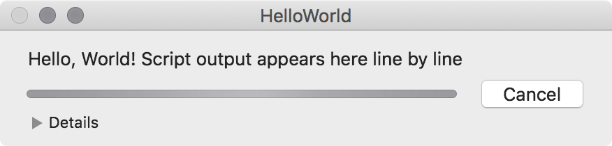
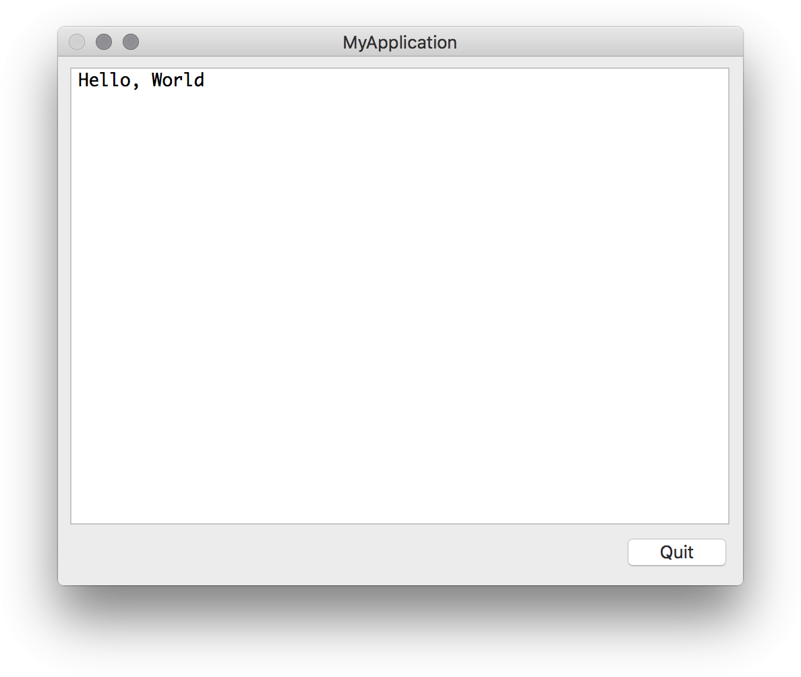
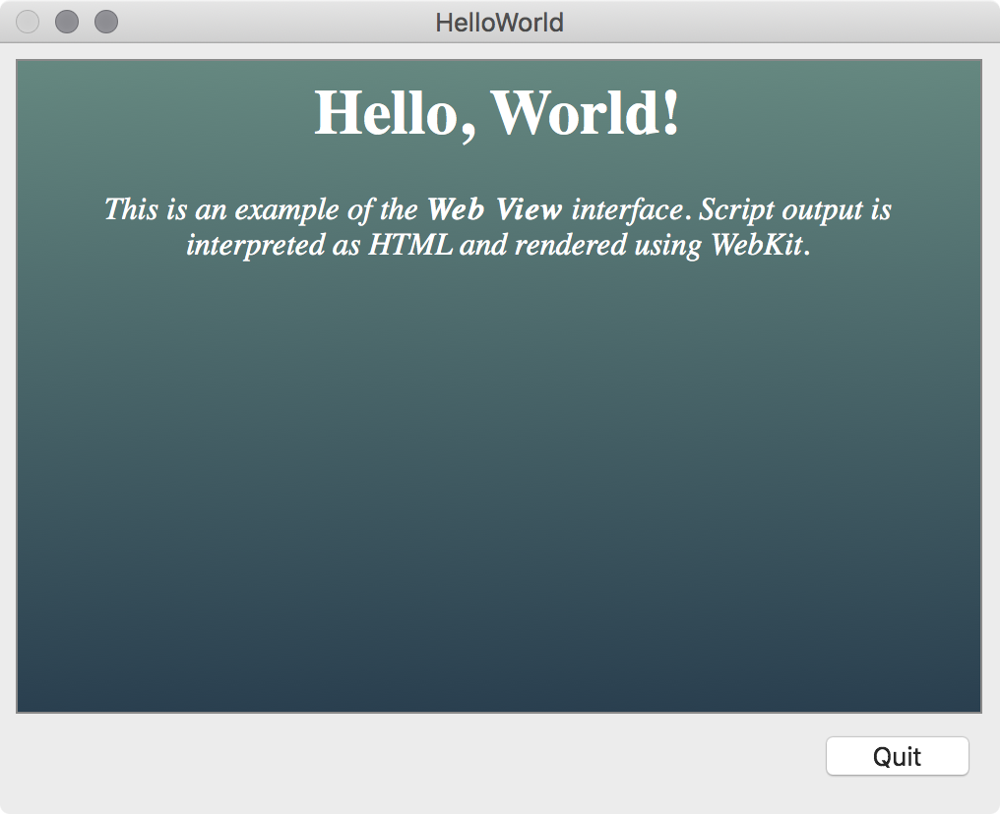
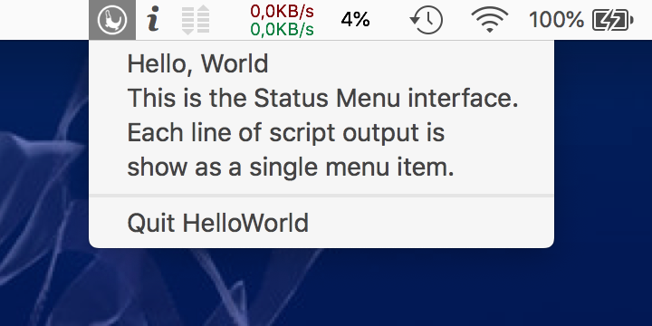
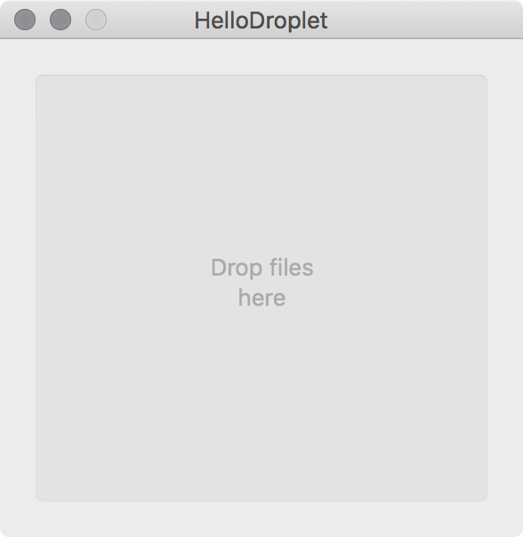

[](https://opensource.org/licenses/BSD-3-Clause)
[]()
[]()

# Platypus


**Platypus** is a developer tool that creates native Mac applications 
from command line scripts such as shell scripts or Python, Perl, Ruby, 
Tcl, JavaScript and PHP programs. This is done by wrapping the script in an 
[application bundle](https://en.wikipedia.org/wiki/Bundle_(OS_X)) along 
with a slim app binary that runs the script.

Platypus makes it easy to share scripts and programs with people who are 
unfamiliar with the command line interface. Native, user-friendly 
applications can be created with a few clicks. It is very easy to 
create installers, droplets, administrative applications, login items, 
status menu items, launchers and automations using Platypus.

## Features

* Supports shell scripts, Python, Perl, Ruby, PHP, Swift, Expect, Tcl, AWK, JavaScript, AppleScript or any other user-specified interpreter
* Apps can display graphical feedback of script execution as a progress bar, text window with script output, droplet, WebKit HTML rendering or status item menu
* Apps support receiving dragged and dropped files or text snippets, which are then passed to the script as arguments
* Apps can execute scripts with root privileges via the macOS Security Framework
* Apps can register as handlers for URI schemes and send user notifications
* Apps can be configured to run in the background (LSUIElement)
* Set own application icon or select from presets
* Set app's associated file types, identifier, version, author, etc.
* Graphical interface for bundling support files with the script
* Command line tool for automation and build process integration
* "Profiles" can be used to save app configurations
* Built-in script editor, or linking with external editor of choice
* Extensive [documentation](Documentation/Documentation.md) and many built-in examples to help you get started
* Generates slim and speedy native applications that launch and run quickly
* Fast, responsive native app written in Objective-C/Cocoa

## Install

<a href="https://www.paypal.com/cgi-bin/webscr?cmd=_s-xclick&hosted_button_id=BDT58J7HYKAEE"></a>

Platypus is free, open source software and has been continuously developed and maintained for a very long time (since 2003). **If you find this program useful, please [make a donation](https://sveinbjorn.org/donations).**

* **[⇩ Download Platypus 5.3](https://sveinbjorn.org/files/software/platypus.zip)**  (Intel 64-bit, 10.8 or later, ~3.1 MB)

Platypus can also be installed via [Homebrew](https://brew.sh) (may not be latest version):

```shell
$ brew install --cask platypus
```

## Links

* [Platypus Documentation](Documentation/Documentation.md)
* [Platypus Website](https://sveinbjorn.org/platypus)
* [man `platypus`](https://sveinbjorn.org/files/manpages/platypus.man.html)
* [Platypus Appcast XML feed](https://sveinbjorn.org/files/appcasts/PlatypusAppcast.xml)

## Screenshots

### Platypus main window


### Interfaces

Platypus lets you select one of several different user interfaces for your script.

#### Progress Bar Interface


#### Text Window Interface


#### Web View Interface


#### Status Menu Interface


#### Droplet Interface


## Building Platypus

To build Platypus, run the following command from the repository root (requires Xcode build tools):

```shell
$ make build_unsigned
```

The resulting application bundle is created in the `products` directory.

## Some notes on the code

Platypus is very old software, dating back to the early days of 
Mac OS X, around 2003, when I was first learning to use Objective-C 
and the Cocoa APIs. I made many beginner mistakes, some of which remain 
in the structure of the code. This software has  since gone through 
about  four dozen significant versions. It has been patched, bugfixed, 
streamlined to include new features and was transitioned over to 
modern Objective-C a few years ago. It's not how I would write it today.

With these caveats in mind, here is the BSD-licensed source code to Platypus.

## BSD License 

Copyright (c) 2003-2021 Sveinbjorn Thordarson 
&lt;<a href="mailto:">sveinbjorn@sveinbjorn.org</a>&gt;
All rights reserved.

Redistribution and use in source and binary forms, with or without modification,
are permitted provided that the following conditions are met:

1. Redistributions of source code must retain the above copyright notice, this
list of conditions and the following disclaimer.

2. Redistributions in binary form must reproduce the above copyright notice, this
list of conditions and the following disclaimer in the documentation and/or other
materials provided with the distribution.

3. Neither the name of the copyright holder nor the names of its contributors may
be used to endorse or promote products derived from this software without specific
prior written permission.

THIS SOFTWARE IS PROVIDED BY THE COPYRIGHT HOLDERS AND CONTRIBUTORS "AS IS" AND
ANY EXPRESS OR IMPLIED WARRANTIES, INCLUDING, BUT NOT LIMITED TO, THE IMPLIED
WARRANTIES OF MERCHANTABILITY AND FITNESS FOR A PARTICULAR PURPOSE ARE DISCLAIMED.
IN NO EVENT SHALL THE COPYRIGHT HOLDER OR CONTRIBUTORS BE LIABLE FOR ANY DIRECT,
INDIRECT, INCIDENTAL, SPECIAL, EXEMPLARY, OR CONSEQUENTIAL DAMAGES (INCLUDING, BUT
NOT LIMITED TO, PROCUREMENT OF SUBSTITUTE GOODS OR SERVICES; LOSS OF USE, DATA, OR
PROFITS; OR BUSINESS INTERRUPTION) HOWEVER CAUSED AND ON ANY THEORY OF LIABILITY,
WHETHER IN CONTRACT, STRICT LIABILITY, OR TORT (INCLUDING NEGLIGENCE OR OTHERWISE)
ARISING IN ANY WAY OUT OF THE USE OF THIS SOFTWARE, EVEN IF ADVISED OF THE
POSSIBILITY OF SUCH DAMAGE.

The Platypus application icon is copyright (C) [Drífa Thoroddsen](https://drifaliftora.is).
